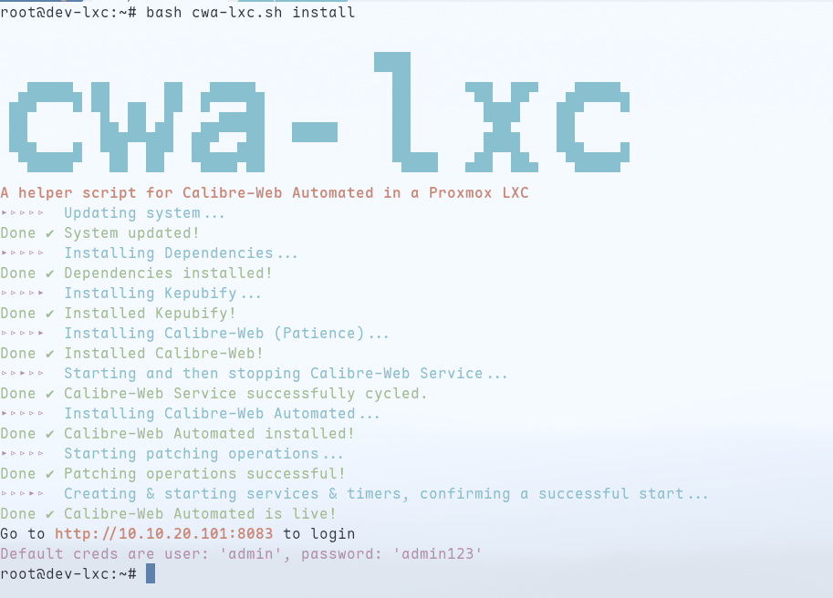

# Calibre-Web Automated LXC (with additional features support)

## Many Thanks

Before going any further, I have to hand it to the creators of Calibre-Web and Calibre-Web Automated, Jan B (janeczku) and crocodilestick: without their hard work, this would not be possible. Please support their work over this project, even if you use this one.

### [Calibre-Web](https://github.com/janeczku/calibre-web)

### [Calibre-Web Automated](https://github.com/crocodilestick/Calibre-Web-Automated)

My project stands on their shoulders, and theirs in turn stands on the shoulders of the creator(s) of Calibre - read about the history of Calibre [here](https://calibre-ebook.com/about#history).

## What is this ❓

I have created this repo to have a place to house a bash script (or a series of bash scripts) that once run, will transform your barebones Proxmox Debian 12 LXC into a full-fledged Calibre-Web Automated installation.

I originally pitched this idea to the maintainers of the [Proxmox Community Helper Scripts](https://community-scripts.github.io/ProxmoxVE/) repo, but for various reasons it was deemed too risky, likely to break spectacularly, and too much effort to maintain. They are probably right (and please do check out their [amazing and extensive library of helper scripts](https://github.com/community-scripts/ProxmoxVE)), so I am going to try to do it myself.

## How to prepare a Debian 12 LXC-Container ❓

There are several ways to prepare your LXC container.

This is one suggested way:

1. Create a new Debian 12 LXC from the [Proxmox VE Helper-Scripts](https://community-scripts.github.io/ProxmoxVE/scripts?id=debian) project page.
2. Take a look at the bash command to start the install script:

```bash
bash -c "$(curl -fsSL https://raw.githubusercontent.com/community-scripts/ProxmoxVE/main/ct/debian.sh)"
```
Please note the script does not support updating the container. You have to take care of this yourself and configure unattended updates for example.

**Log into your Proxmox PVE webpage and launch this command inside your Proxmox PVE host system shell to create a new container.**

2. The minimum required specs for the container are:

* 2 CPU's
* 2GB ram
* 5GB disk size

The disk size depends on your usecase. If you want to store your data inside the container aswell, please add more space to the container, as these are only the minimum requirements to keep the container running.

## What does it look like ❓

It's pretty. But you can also use `-v` to tell it to spew out all the output to the screen, if you're into that.



## How do I use it ❓

1. Start with a freshly-baked Debian 12 LXC in Proxmox (a bare-metal Debian 12 might work as well, have not tested). [See above](#how-to-prepare-a-debian-12-lxc-container-) how to do this.

   - Support for other LXCs may be added in the future
2. Get the latest version of the script - grab from [Releases](https://github.com/vhsdream/calibre-web-automated-lxc/releases/latest) or clone the repo.
3. Run the script as root.

```bash
bash cwa-lxc.sh [-h,--help][-v,--verbose][--no-color] install
```

## What else can the script do for me ❓

There is an another switch to extend functionality.

For now there is an option to enable shares for the library and ingest folder via SSHFS.
The main idea behind this is to keep data out of the LXC container to keep it tiny and low on resources.

Use the ``features`` option to get into the features menu.

```bash
bash cwa-lxc.sh [-h,--help][-v,--verbose][--no-color] features
```

 More features might be added in the future.

## It didn't work 😿

Sorry. Please open an issue and I'll look into it.
